# Base de données relationnelle

Le développement des traitements informatiques nécessite la manipulation de données de plus en plus
nombreuses. Leur organisation et leur stockage constituent un enjeu essentiel de performance. Le recours
aux bases de données est aujourd’hui une solution très répandue. Ces bases de données permettent
d’organiser, de stocker, de mettre à jour et d’interroger des données structurées volumineuses utilisées
simultanément par différents programmes ou différents utilisateurs. Cela est impossible avec les
représentations tabulaires étudiées en classe de première (comme le fichier csv).
Il existe différents types de base de données. Nous étudierons ici les bases de données relationnelles.
Comme leurs noms l'indiquent, elles s'appuient sur le modèle relationnel.

C'est en 1970 qu'Edgar F.Codd pose les fondements des bases de données relationnelles.
<a href="https://fr.wikipedia.org/wiki/Edgar_Frank_Codd"> En savoir plus sur Edgar Codd</a>

## Modèle relationnel

 - Une <b>relation</b> est considérée comme une table à 2 dimensions. Elle contient des colonnes et des lignes.
 - Un <b>attribut</b> correspond à une colonne. A chaque attribut, on définit un domaine, c'est-à-dire l'ensemble
   des valeurs prises par l'attribut.
 - Un <b>enregistrement</b> est un -uplet mettant en relation les attributs. C'est donc une des lignes du tableau.
 - Une <b>entrée</b> (ou valeur) est une case du tableau.
 

Exemple : 

C'est la table abscence_modif de la base de données arrasgambetta

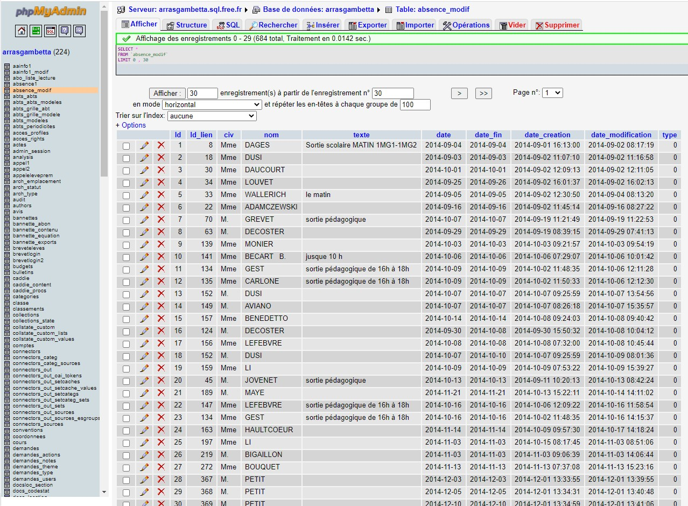

Cette relation s'appelle : abscence_modif
Elle est composée de 10 attributs : Id, Id_lien, civ, nom, texte, date, date_fin, date_creation, date_modification, type.

Le domaine de l'attribut id est l'ensemble des entiers (interger) alors que le domaine de
l'attribut nom est l'ensemble des chaines de caractères ( string ).

L'entrée de l'attribut nom de l'enregistrement dont l' id vaut 8 est 'DECOSTER'.

 - Un <b>schéma relationnel</b> est l'ensemble des relations d'une base de données. Les liens entre ces relations
sont stockées via des clés primaires et étrangères de 2 relations.

 - Une <b>clef primaire</b> (Primary Key) identifie de manière unique un enregistrement d'une relation. Elle ne peut
être vide ( NULL ). Elle peut être composée d'un ou plusieurs attributs.

 - Une <b>clef étrangère</b> (Foreign Key) référence la clé primaire (donc un ou plusieurs attributs) d'une autre
relation. Les entrées des attributs référencés doivent déjà exister.

Dans ce cours, nous nous réstreindrons à des clefs primaires composées d'un seul attribut.

Exemple:

Voici la relation professeurs de la même base de données qeu la relation abscence_modif précédente.

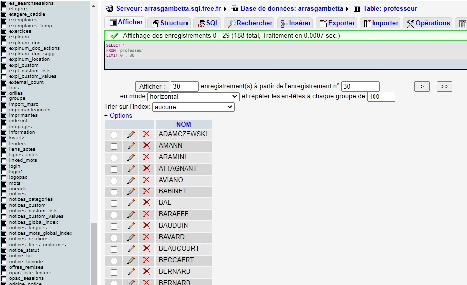

L'attribut nom de la relation absences_modif est une clé étrangère et fait référence à l'attribut nom de la
relation professeur.

On peut établir le schéma relationnel suivant:

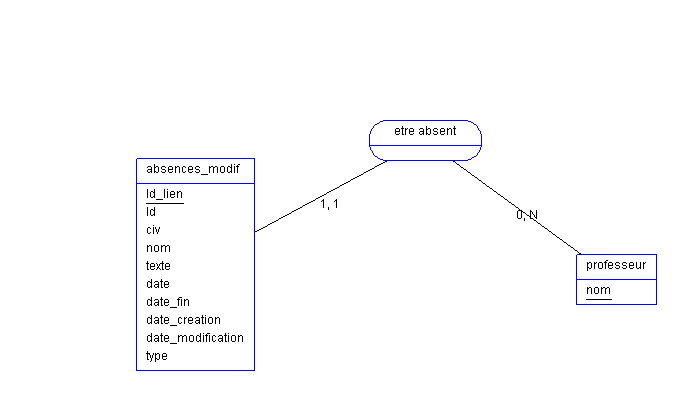

La relation absences_modif possède une clef étrangère qui référence la clé primaire de la relation professeur . 

Il y a donc une association ("être absent")entre les relations absences_modif et professeurs .

Sur cette association, deux informations numériques:

 - un du côté de la relation professeur 0, N : un professeur au minimum 0 absences jusque N possibles
 - un du côté de la relation absences_modif : 1,1 : une absence correspond au minimum à 1 professeur et au maximum à 1 professeur
 - 
Ces deux informations indiquent que chaque association est faite entre 1 enregistrement de la relation
absence_modif et au moins  enregistrement de la relation albums .

Ces informations sont toujours de la forme x,y et étant des nombres avec x <= y 
Cela signifie n'importe quel nombre entre et x et y .

Dans le cas où x=y, on peut juste écrire x .

Enfin, le symbôle N signifie "pas de limite", il peut être aussi remplacé par *

Dans notre exemple, il peut y avoir des associations "être absent" entre 1 enregistrement de la relation
absence_modif et au moins 0 enregistrement de la relation professeur .

La création d'associations entre différentes relations permet d'éviter la redondance d'informations.

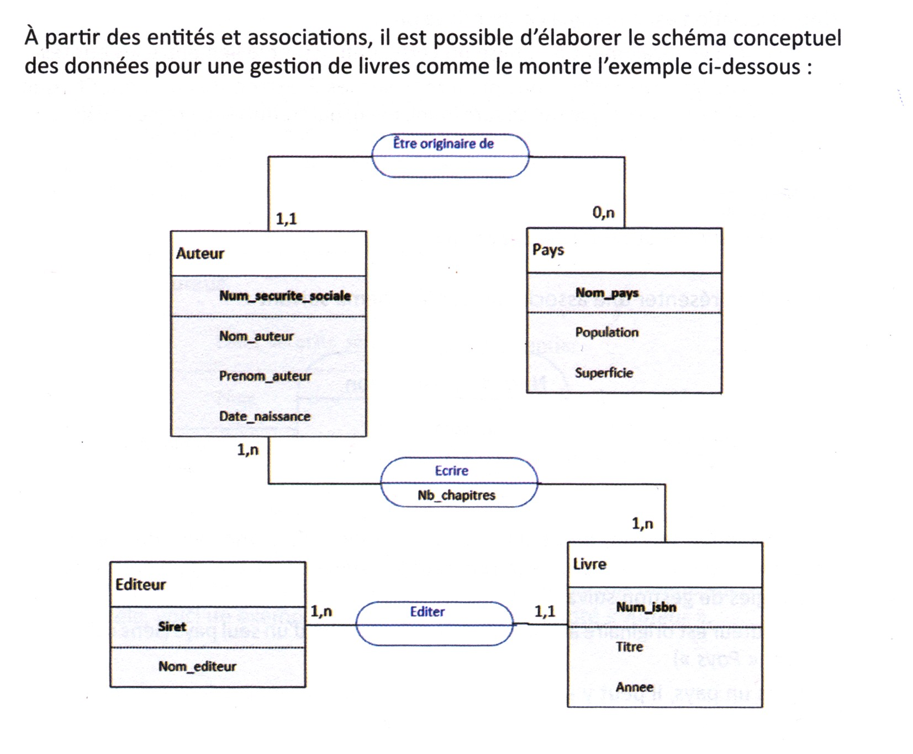

# Passage au modèle relationnel 

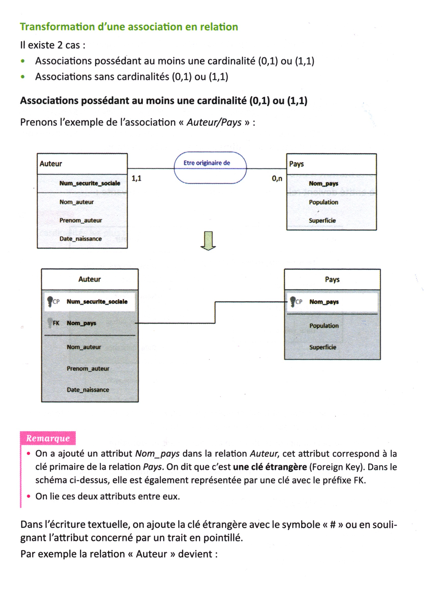
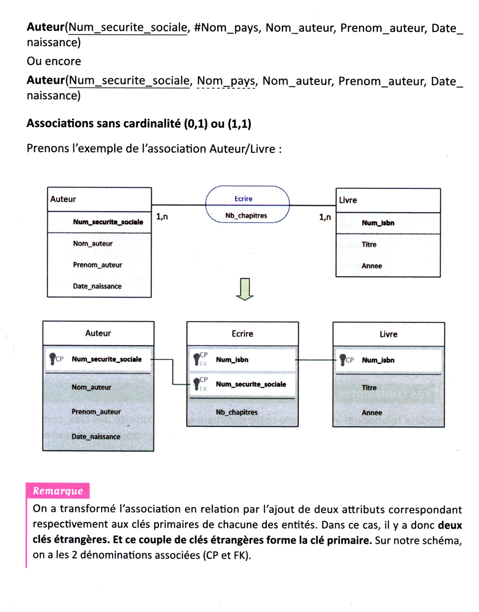
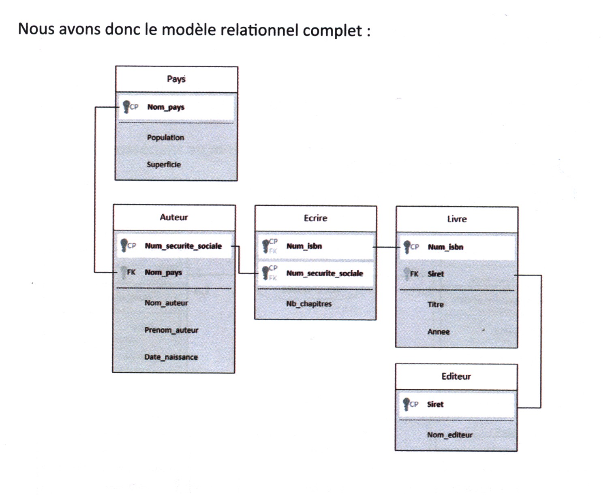

# Base de données relationnelle

1. Généralités

Une base de données relationnelles est une collection d'informations organisées en tables, sur des sujets
connexes. Ces dernières peuvent être associées ou non.

Un système de gestion de bases de données relationnelles (SGBDR), comme son nom l'indique, est un
logiciel qui permet de gérer des bases de données relationnelles. On pourra notamment:

 - créer une base de données
 - créer ces tables
 - modifier des tables (ajout ou suppression d'attributs)

Il rend différent services comme la garantie de :

 - la qualité des informations et donc l'efficacité des traitements des requêtes
 - la pérennité (persistance) des informations
 - la confidentialité des informations et donc la sécurisation des accès
 - la gestion des accès concurrents

Des systèmes de gestion de bases de données de très grande taille (de l’ordre du pétaoctet) sont au centre
de nombreux dispositifs de collecte, de stockage et de production d’informations.
Nous utiliserons le SGBDR Sqlite ou phpmyadmin.

# Contraintes d'integrité

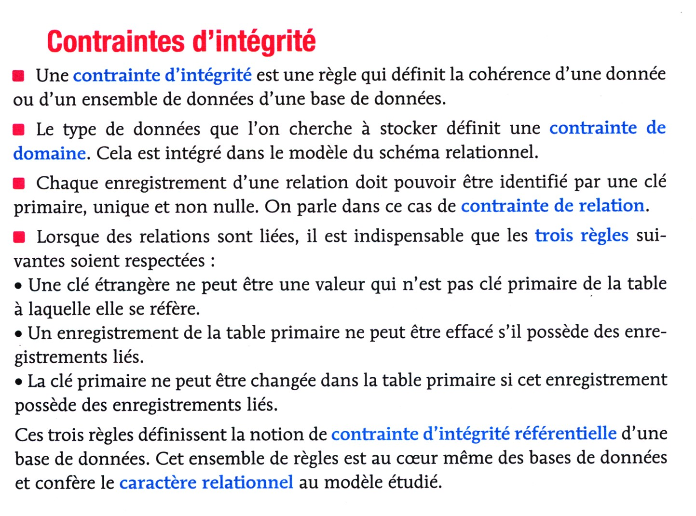

## Exemples et exerices :

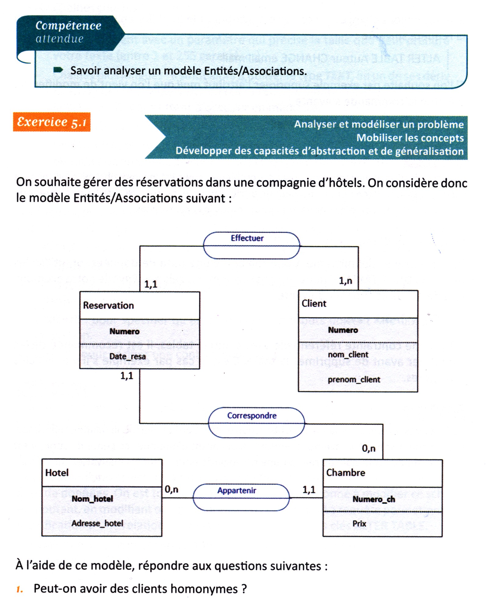

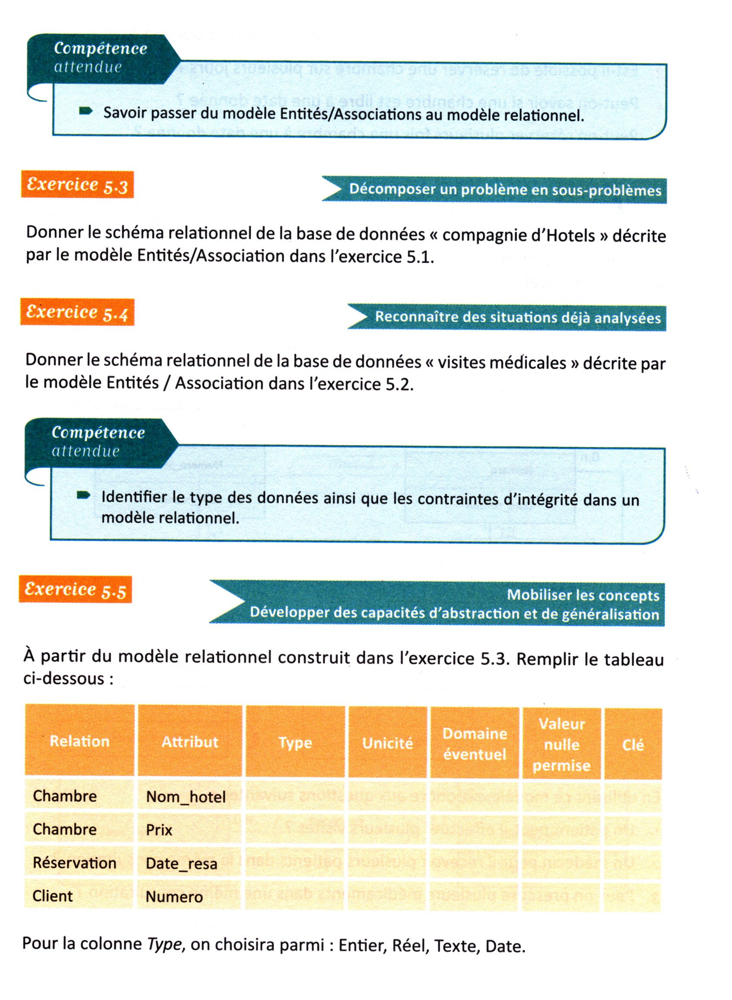
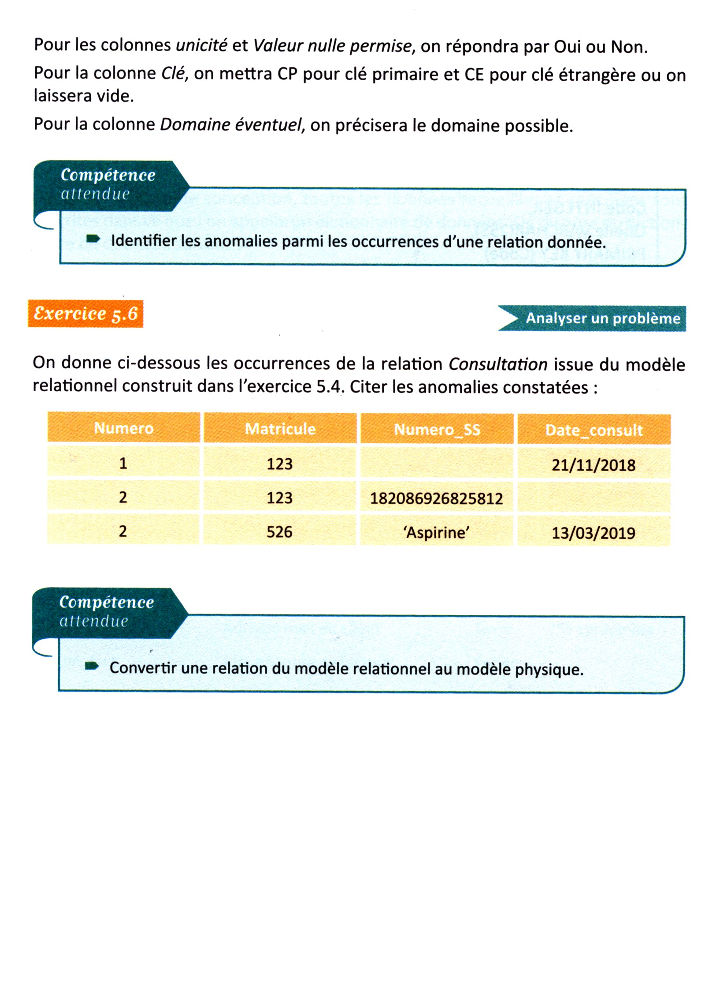

# Exercices :
<a href="http://pise.info/modelisation/enonces.htm#exo3"> Cliquer ici </a>

